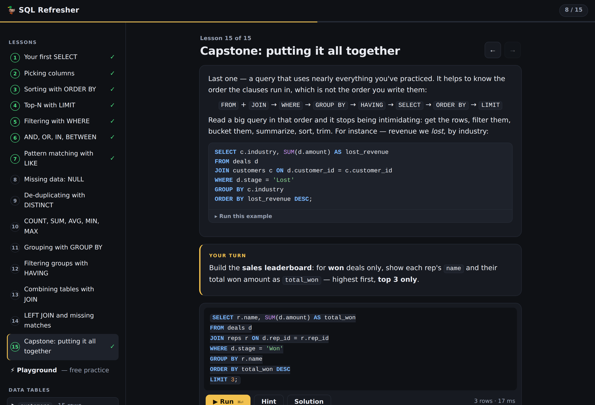

# 🦆 SQL Refresher

An interactive refresher on SQL basics — 15 hands-on lessons that run against a **real database in your browser**. Powered by [DuckDB-WASM](https://duckdb.org/docs/stable/clients/wasm/overview): no server, no account, nothing leaves your device. Works great on a phone.



## What you practice

Each lesson explains one idea, gives runnable examples, then grades your answer against a reference result (with hints, the expected output, and the solution one tap away). Progress is saved locally, per device.

1. Your first `SELECT` · 2. Picking columns & `AS` · 3. `ORDER BY` · 4. Top-N with `LIMIT` · 5. `WHERE` · 6. `AND` / `OR` / `IN` / `BETWEEN` · 7. `LIKE` patterns · 8. `NULL` · 9. `DISTINCT` · 10. `COUNT` / `SUM` / `AVG` / `MIN` / `MAX` · 11. `GROUP BY` · 12. `HAVING` · 13. `JOIN` · 14. `LEFT JOIN` · 15. Capstone — all of it at once

After the lessons there's a free-form **Playground** (DDL and all — a reset button restores the sample data).

The sample data is a tiny CRM — `customers` (15), `deals` (30), and `reps` (5) — so the queries feel like questions you'd actually ask: *biggest open deals, industries with the most customers, won revenue by rep*.

## Run it locally

It's a fully static site — any file server works:

```bash
python3 -m http.server 8000
# → http://localhost:8000
```

## Deploy to Vercel

The site is zero-config static hosting: at [vercel.com/new](https://vercel.com/new), import **`lmansf/SQL-refresher`**, leave every setting at its default (Framework: **Other**, no build command, no output directory), and hit **Deploy**. You'll get a `*.vercel.app` URL you can open anywhere, including your phone.

The first visit downloads the ~9 MB (compressed) engine; `vercel.json` marks it immutable so revisits are instant. Note that progress lives in `localStorage`, so it's per device. Any other static host (GitHub Pages, Netlify, …) works just as well.

## How it works

- **DuckDB-WASM 1.32.0** is vendored in `vendor/` (the `eh` bundle, self-contained ESM built with esbuild — no CDN, no build step, no runtime dependencies). Requires a browser with WebAssembly exception handling: Chrome 95+, Safari 15.2+, Firefox 100+.
- `lessons.js` holds the course content and seed data; `db.js` wraps the engine and normalizes Arrow values (dates, BigInt, 128-bit decimals) into display strings; `app.js` is the UI — routing, a syntax-highlighted editor, and the checker.
- **Grading** compares your result's *values* against the reference query's result, so different column aliases still pass; row order only matters in the `ORDER BY` lessons.

### Tests

A Playwright end-to-end suite boots the real site headless and verifies the engine starts, every lesson's reference solution is accepted, and grading/errors/playground/reset/mobile all behave:

```bash
cd test && npm install && npm test
```

### Updating DuckDB

```bash
npm install @duckdb/duckdb-wasm@<version> esbuild
echo "export * from '@duckdb/duckdb-wasm';" > entry.js
npx esbuild entry.js --bundle --format=esm --minify --outfile=vendor/duckdb-wasm.mjs
cp node_modules/@duckdb/duckdb-wasm/dist/{duckdb-browser-eh.worker.js,duckdb-eh.wasm} vendor/
```
